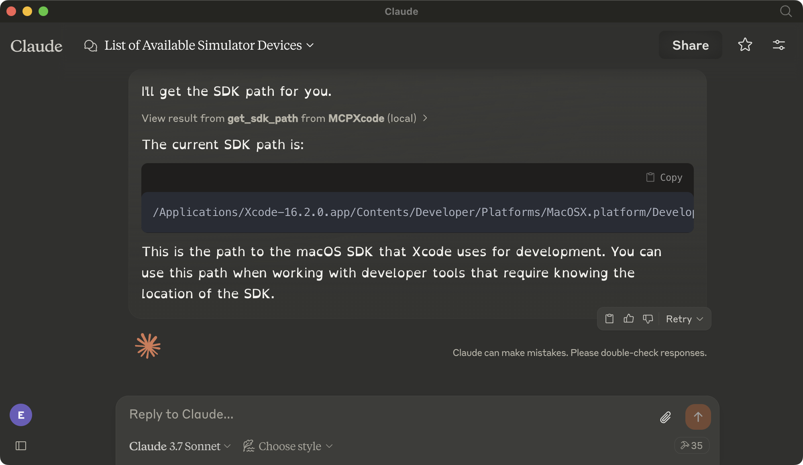
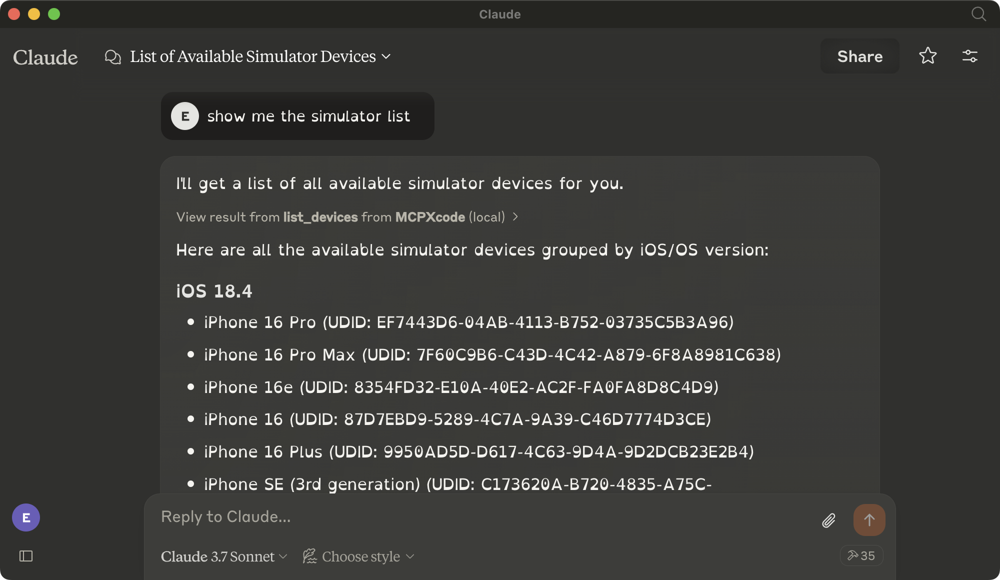

# MCPXcode

*!!! This Project is in Active Development, So May Have Unexpected Issues*


## Introduction

MCPXcode is an open-source implementation of the [Model Context Protocol (MCP)](https://modelcontextprotocol.io/introduction) for Xcode. It enables seamless integration between Xcode and AI assistants by providing a structured protocol for context exchange and tool execution within the Xcode environment.

Following the MCP specification, this project creates a bridge between Xcode's development environment and AI tools, allowing for enhanced developer workflows through contextual understanding and programmable interactions. It wraps common command-line tools (`xcrun`, `xctrace`) and leverages macOS accessibility features to enable AI-assisted automation of Xcode operations.


## Screenshots

<p align="center">
  
  
</p>


## Installation

```bash

# Install uv
curl -LsSf https://astral.sh/uv/install.sh | sh

# Clone the repository
git clone https://github.com/everettjf/MCPXcode.git
cd MCPXcode
source .venv/bin/activate
uv add "mcp[cli]"
```

## Configuration


```json
{
  "mcpServers": {
    "MCPXcode": {
      "command": "uv", # may use full path
      "args": [
        "--directory",
        "<Path>/MCPXcode", # change to your full path
        "run",
        "main.py"
      ]
    }
  }
}
```


## Features

### Current MCP Tool Integrations

- **xcrun Tool Extensions**
  - Context-aware interfaces for common xcrun commands
  - Structured output formatting for AI consumption
  - Semantic error handling and diagnostic reporting

- **xctrace Tool Extensions**
  - Context-enhanced profiling and tracing for iOS/macOS applications
  - Structured performance metrics collection for AI analysis
  - Trace data processing with semantic context

### Planned Extensions

- **Accessibility Tool Extensions**
  - Context-aware UI interactions within Xcode
  - Semantic triggers for build, run, and test operations
  - Structured project navigation capabilities
  - Enhanced context extraction from Xcode UI

- **MCP HTTP Server**
  - Full MCP specification compliance over HTTP
  - Standardized tool execution protocol
  - Context-preserving webhooks for build events
  - Seamless integration with AI-powered CI/CD pipelines

- **MCP Client Libraries**
  - Language-specific SDKs implementing the MCP specification
  - Simplified context exchange between AI assistants and Xcode


## Tool Documentation

### Simulator Control Tools

| Tool | Description | Example Prompt |
|------|-------------|----------------|
| `list_devices` | List all available simulator devices with detailed information | "Show me all available iOS simulator devices and their status." |
| `boot_device` | Boot a specific simulator device identified by its UDID | "Boot the iPhone 14 Pro simulator with UDID A1B2C3D4-E5F6-7890-1234-567890ABCDEF." |
| `shutdown_device` | Shutdown a running simulator device | "Shutdown the currently running iPhone simulator with UDID A1B2C3D4-E5F6-7890-1234-567890ABCDEF." |
| `install_app` | Install an application on a simulator device | "Install the app at path /Users/username/MyApp.app on the iPhone 14 simulator." |
| `launch_app` | Launch an installed application on a simulator device | "Launch the app with bundle ID com.example.myapp on the iPhone 14 simulator." |

### SDK Tools

| Tool | Description | Example Prompt |
|------|-------------|----------------|
| `get_sdk_path` | Get the path of the current SDK | "What is the path to the current iOS SDK?" |
| `get_sdk_version` | Get the version of the current SDK | "What version of the iOS SDK am I using?" |
| `get_sdk_platform_path` | Get the platform path of the current SDK | "Where are the iOS platform files located?" |
| `find_developer_tool` | Find the path of a specific developer tool | "Where is the 'lldb' binary located in the Xcode toolchain?" |
| `run_tool_with_sdk` | Run a developer tool with a specific SDK | "Run the 'clang' tool with the iOS SDK to compile my source file." |

### xcrun Tools

| Tool | Description | Example Prompt |
|------|-------------|----------------|
| `xcrun_list_sdks` | List all available SDKs with detailed information | "Show me all available SDKs I can build against." |
| `xcrun_list_schemes` | List all schemes in a specified Xcode project | "What are all the build schemes in my MyApp.xcodeproj project?" |
| `xcrun_build` | Build an Xcode project with specified scheme and configuration | "Build my MyApp.xcodeproj project using the Debug configuration for the iPhone simulator." |
| `xcrun_validate_app` | Validate an app before submission to App Store | "Validate my MyApp.ipa file before submitting it to the App Store." |
| `xcrun_upload_app` | Upload an app to App Store Connect | "Upload my validated MyApp.ipa file to App Store Connect for review." |
| `xcrun_swift_symbols` | Extract Swift symbols from a binary file | "Extract and show me all Swift symbols from my app's binary." |
| `xcrun_otool_headers` | Show Mach-O headers of a binary file | "Show me the Mach-O headers of my app's binary file." |
| `xcrun_otool_libraries` | Show linked libraries of a binary file | "What libraries is my app's binary linked against?" |
| `xcrun_nm_symbols` | Show symbols in a binary file | "Show me all symbols in my app's binary file." |

### xctrace Tools

| Tool | Description | Example Prompt |
|------|-------------|----------------|
| `xctrace_devices` | List available devices for tracing | "Show me all devices I can run performance traces on." |
| `xctrace_templates` | List available templates for tracing | "What trace templates are available for performance profiling?" |
| `xctrace_record` | Record app performance using a specified template | "Record a performance trace of my app using the Time Profiler template." |
| `xctrace_record_advanced` | Record app performance with advanced options | "Record a performance trace with custom template options and set the environment variable DEBUG=1." |
| `xctrace_attach_process` | Attach to a running process for tracing | "Attach a performance tracer to my running app with process ID 12345." |
| `xctrace_export` | Export trace data to a specified format | "Export my trace.trace file to JSON format for analysis." |
| `xctrace_diagnose` | Diagnose a trace archive for issues | "Analyze my trace file for any performance issues or problems." |
| `xctrace_document` | Generate documentation for a template | "Create documentation for the Allocations template so I can understand its metrics." |
| `xctrace_analyze` | Analyze a trace file and generate performance reports | "Generate performance reports from my time profiler trace file." |
| `xctrace_compare` | Compare two trace files and generate a comparison report | "Compare the performance between trace files from version 1.0 and version 2.0 of my app." |


## Project Roadmap

### Phase 1: MCP Core Implementation (Q2 2025)
- ✅ Basic project structure
- ⬜ Tool extensions for essential xcrun commands with context handling
- ⬜ Tool extensions for basic xctrace functionality with context handling
- ⬜ MCP-compliant CLI interface

### Phase 2: MCP Server Implementation (Q3 2025)
- ⬜ Full MCP specification HTTP server
- ⬜ Context-aware authentication and security
- ⬜ Structured context exchange protocol
- ⬜ Extensible tool registry architecture

### Phase 3: MCP Accessibility Extensions (Q4 2025)
- ⬜ macOS accessibility integration with semantic context
- ⬜ Context-aware Xcode UI automation
- ⬜ Semantic event monitoring and contextual reactions

### Phase 4: Advanced MCP Features (Q1 2026)
- ⬜ MCP-compliant Python client library
- ⬜ Context-aware integration with AI-powered CI/CD tools
- ⬜ Semantic context monitoring dashboard


## License

This project is licensed under the MIT License - see the LICENSE file for details.

## Contributing

Contributions are welcome! Please feel free to submit a Pull Request.